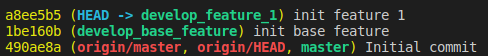

# [GIT] Common Git In Development
<p align="jusity">
Hôm nay, mình sẽ giới thiệu một số kỹ thuật xử lý tùy với tình huống trong quá trình phát triển dự án cùng với GIT.
</p>

## Change base branch
Command

```git
git rebase --onto new_base_branch old_base_branch change_branch
```

<i>Example</i>
<p align="jusity">

1. Check log `develop_feature_1`

```git
git checkout develop_feture_1
git log --oneline
```
<p align="center">
</img>
</p>
Hiện tại `develop_feature_1` đang base trên nhánh `master` và đang có 1 commit

2. Check log `develop_base_feature`

```git
git checkout develop_base_feature
git log --oneline
```
<p align="center">
</img>
</p>

Hiện tại `develop_base_feature` đang base trên nhánh `master` và cũng đang có 1 commit

3. Thực hiện thay đổi base branch của `develop_feature_1` từ `master` sang `develop_base_feature`

```git
git rebase --onto develop_base_feature develop_feature_1
```

Check log `develop_feature_1` sau khi thay đổi base branch

```git
git checkout develop_feature_1
git log --oneline
```
<p align="center">
</img>
</p>
</p>
<p align="jusity">

Hiện tại `develop_feature_1` đã base trên `develop_base_feature`

Bản chất ở đây là tất cả các commit của `develop_feature_1` được chuyển nối tiếp với các commit của `develop_base_feature`. Chúng ta xem hình bên dưới để hiểu rõ hơn về ví dụ trên
<p align="center">
</img>
</p>
Sau khi change base branch
<p align="center">
</img>
</p>

Nếu trong quá trình thay đổi base branch có conflic thì xử lý conflic và rebase continue.
</p>

## Integrating Branchs
<p align="justify">

Chúng ta có thể tích hợp 2 nhánh với nhau bằng cách sử dụng `merge` hoặc `rebase`. Tùy mục đích và rule trong quá trình phát triển project mà chúng ta sẽ lựa chọn hơp lý giữa `merge` và `rebase`

Gỉa sử chúng ta có một git history như sau
</p>
<p align="center">
</img>
</p>

### Merge
Command

```git
git merge integration_branch current_branch

or

git checkout current_branch
git merge integration_branch
```
<p align="center">
</img>
</p>

<p align="justify">

Khi thực hiện merge `integration_branch` vào `current_branch`, một `commit merge` sẽ được tạo ra (commit `*` trong hình) trên `current_branch`. 

`Commit merge` là commit kết hợp tất cả các commit mới trên `current_branch` và tất cả các commit mới trên `integration_branch` tính từ commit mà `current_branch` được phân nhánh ra hoặc từ commit mà `integration branch` được merge vào `current_branch` (nếu thực hiện merge nhiều lần).

Merging sẽ không làm thay đổi commit history, `commit id` trên `current_branch`, nó sẽ chỉ tạo ra duy nhất một `commit_merge`. Tuy nhiên nếu `integration_branch` có sự thay đổi một cách liên tục thì việc thực hiện merging sẽ dẫn tới commit history sẽ rất lằng nhằng và khó hiểu mặc dù chúng ta có thể hạn chế việc này bằng cách sử dụng những option của `git log`. 

Nếu chúng ta thực hiện merge từ những nhánh feature vào nhánh chính (VD: master, develop), nó sẽ giúp ta có thể thấy được sự thay đổi một cách rõ ràng bắt đầu từ nhánh feature nào, từ đó có thể trace bug dễ dàng. Tuy nhiên thì so nó lại không lưu lại những commit từ nhánh feature mà chỉ có duy nhất một `commit merge`.

Trong quá trình merge nếu gặp conflic thì xử lý conflic và tiếp tục merge bằng cách sử dụng `git merge --continue` hoặc có thể sử dụng `git merge --abort` để hủy bỏ quá trình merge.

Sau khi merge thành công, nếu muốn quay lại trạng thái history trước khi merge, chúng ta có thể sử dụng `git reset --hard ORIG_HEAD`

<i>Example</i>

1. Check log `develop_feature_6`

```git
git checkout develop_feature_6
git log --oneline
```
<p align="center">
</img>
</p>

2. Check log `develop_feature_7` (base branch: `develop_feature_6`)

```git
git checkout develop_feature_7
git log --oneline
```
<p align="center">
</img>
</p>

3. Thực hiện merge `develop_feature_6` vào `develop_feature_7` và xem kết quả.

```git
git checkout develop_feature_7
git merge develop_feature_6
git log --oneline --graph --decorator
```
<p align="center">
</img>
</p>

4. Chúng ta có thể thực hiện 1 số commit mới trên `develop_feature_6` và `develop_feature_7`, sau đó thực hiện lại step 3 và xem kết quả.
<p align="center">
</img>
</p>

Nhìn vào kết quả chúng ta có thể thất rằng các commit đã được merge, thứ tự các commit và `commit id` không bị thay đổi.
</p>

### Rebase
Command

```git
git checkout current_branch
git rebase integration_branch
```
<p align="center">
</img>
</p>
<p align="justify">

Các commit mới của `integration_branch` tính từ commit mà `current_branch` được phân nhánh ra sẽ được đưa sang `current_branch` và tiếp nối sẽ là những commit mới của `current_branch`.

So với merge sẽ tạo thêm một `commit merge` thì rebase sẽ thực hiện rewrite lại tất cả các commit của `integration_branch` và `current_branch` trên `current_branch` và các commit mới của `current_branch` sẽ bị thay đổi `id`.

Commit history khi sử dụng rebase sẽ dễ nhìn và rõ ràng hơn so với sử dụng merge và rebase cũng sẽ lưu lại tất cả commit. Tuy nhiên chúng ta sẽ không biết được thời điểm và các commit của `integration_branch` được đưa vào `current_branch`. Khả năng truy vết khi sử dụng rebase cũng sẽ khó hơn so với merge.

Do rebase sẽ rewrite lại toàn bộ history nên một rủi ro nữa khi sử rebase đó là nhầm lần giữa `integration_branch` và `current_branch`. Ví dụ như khi chúng ta phát triển một feature và tách nó thành một nhánh `feature` từ `master`. Trong khi đó `master` cũng được update một số thay đổi mới. Thay vì chúng ta rebase `master` vào `feature` để lấy những thay đổi mới đó và tiếp tục với `feature` thì lại nhầm rebase `feature` vào `master`. Kết quả là commit history của `master` sẽ bị rewrite toàn bộ và đó sẽ là một thảm họa.

Trong quá trình rebase nếu gặp conflic thì xử lý conflic và tiếp tục rebase bằng cách sử dụng `git rebase --continue` hoặc có thể sử dụng `git rebase --abort` để hủy bỏ quá trình rebase.

Sau khi rebase thành công, nếu muốn quay lại trạng thái history trước khi rebase, chúng ta có thể sử dụng `git reset --hard ORIG_HEAD`

<i>Example</i>

1. Check log `feature_1`
```git
git checkout feature_1
git log --oneline
```
<p align="center">
</img>
</p>

2. Check log `feature_2` (base branch: `feature_1`)
```git
git checkout feature_2
git log --oneline
```
<p align="center">
</img>
</p>

3. Thực hiện rebase `feature_1` vào `feature_2` và xem kết quả.
<p align="center">
</img>
</p>

Chúng ta thấy ở ví dụ trên các commit của `feature_1` đã được chuyển sang `feature_2` và các commit mới của `feature_2` nằm trên ngọn của history. Các commit đã được rewrite và `commit_id` đã bị thay đổi.
</p>

## Combine Commits
<p align="justify">
Trong qúa trình phát triển, đôi khi chúng ta có một số nhầm lẫn hoặc thiếu sót mỗi lần thực hiện commit. Khi đó chúng ta có thể tạo thêm một vài commit mới để update những phần còn thiếu cho commit ban đầu. Tuy nhiên việc này sẽ dẫn tới việc commit history sẽ rất là rác, sẽ rất nhiều commit không cần thiết mà đáng nhẽ nó phải được hoàn thành từ commit đầu tiên.

Sau đây sẽ là một số use case chúng ta thường gặp trong quá trình phát triển và solution để resovle nó.

### Use case 1
Giả sử chúng ta đang phát triển một feature mới trên branch `feature_3`. Sau khi fix bug trên `feature_3` chúng ta thực hiện một commit `update feature 3`. Tuy nhiên sau đó chúng ta lại thấy thiếu một số phần nữa dẫn tới bug nên ta tạo thêm hai commit `update feature 3 v1` và `update feature 3 v2`.

Commit history như sau
<p align="center">
</img>
</p>

Bây giờ, chúng ta muốn gộp tất cả các commit fix bug ở trên thành duy nhất một commit `fix bug feature 3` để commit history được rõ ràng và bớt rác hơn.

<i>Solution:</i> sử dụng `interactive rebase` cùng với `squash` hoặc `fixup`

1. Thực hiện interactive trên `feature_3`
Chúng ta sử dụng `interactive rebase` để có thể  gộp nhiều commit lại thành môt commit.

Command
```git
git rebase -i HEAD~N (git rebase -interactive HEAD~N) 
or
git rebase -i [commit_id]
```
Chúng ta cần xác định số lượng commit muốn gộp tình từ commit hiện tại hoặc `commit_id` của commit mà các commit muốn gộp bắt đầu từ nó

Với ví dụ trên, chúng ta sẽ thực hiện như sau:

1. Thực hiện interactive rebase trên `feature_3`

Ở đây, chúng ta muốn gộp ba commit `f9daa73`, `da4d5aa` và `87fa458`
```git
git checkout feature_3

git rebase -i 48e891e (git rebase --interactive 48e891e)
or
git rebase -i HEAD~3 (git rebase --interactive HEAD~3)
```
Sau khi thực hiện command trên, một editor sẽ hiện ra, chúng ta sẽ thấy các commit chúng ta muốn gộp và các prefix của từng commit
<p align="center">
</img>
</p>

2. Thay đổi prefix của các commit muốn gộp vào commit gốc thành `squash` hoặc `s` và save lại

Ở đây, chúng ta sẽ gộp `f9daa73`, `da4d5aa` vào `87fa458`
<p align="center">
</img>
</p>

4. Một editor tiếp theo sẽ hiện lên, message của tất cả các commit, thông tin về những thay đổi được hiển thị tại đây.
Chúng ta sẽ thay đổi commit message thành `fix bug 3`
<p align="center">
</img>
</p>

5. Check log `feature_3` và xem kết quả
Chúng ta thấy các commit đã được gộp lại, chú ý rằng `commit_id` đã bị thay đổi
<p align="center">
</img>
</p>

Chúng ta cũng có thể sử dụng prefix `fixup` hay `f` để thực hiện gộp commit giống `squash`, tuy nhiên option này sẽ không hiện editor để có thể thay đổi commit của commit gốc.

### Use Case 2
Giả sử chúng ta đang phát triển một feature mới trên branch `feature_4`. Sau khi hoàn thành feature trên `feature_4` chúng ta thực hiện một commit `develop feature 4`. Sau đó chúng ta thực hiện một commit để add thêm một số hình ảnh `update image for feature 4` Tuy nhiên sau đó chúng ta phát hiện thấy thiếu một số phần phát triển của feature nên thêm một commit và muốn gộp luôn commit này vào commit `update feature 4`.

Tuy nhiên, giữa hai commit này tồn tại commit `update image for feature 4` và chúng ta không muốn gộp commit này.

Commit history như sau
<p align="center">
</img>
</p>

<i>Solution:</i> sử dụng `fixup commit` và `interactive rebase` cùng với option `autosquash`

1. Thực hiện fix-up commit với commit gốc

Command
```
git add --fix-up [original_commit_id]
```
Với ví dụ này chúng ta sẽ gộp vào commit `b655113`
```
git add --fix-up b655113
```
Check log `feature_4` và xem kết quả.
<p align="center">
</img>
</p>

Chúng ta có thể thấy commit hiện tại có message dạng `fixup! [original_commit_message]`

3. Thực hiện `interactive rebase` với option `autosquash`

Giống với ví dụ trên, chúng ta sẽ thực hiện `interactive rebase` nhưng với option `autosquash`
```git
git rebase -i --autosquash b10393e
```
Chú ý `commit id` ở đây là commit mà `original_commit` bắt đầu từ đó. Ví dụ này là commit `b10393e`
Sau khi thực hiện command trên, một editor sẽ hiện lên, chúng ta có thể thấy thứ tự commit và prefix của commit đã tự động được thay đổi. Chúng ta chỉ việc save lại.
<p align="center">
</img>
</p>

4. Check log `feature_4` sau khi hoàn thành và xem kết quả
<p align="center">
</img>
</p>

Chúng ta thấy commit đã được gộp, commit history và `commit id` đã thay đổi.

Trên đây là một số vấn đề mình từng gặp phải trong quá trình phát triển dự án và cách giải quyết. Hẹn gặp lại các bạn ở những bài viết tiếp theo.
</p>

