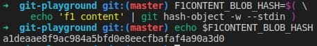
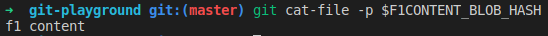
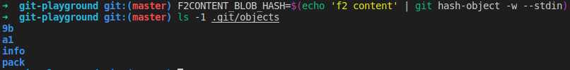
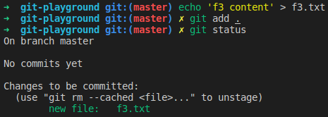
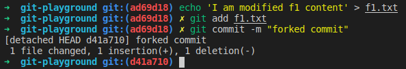
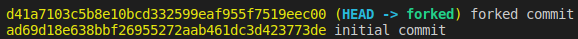

# Internal Git Architecture

<p align="justify">

Chắc hẳn chúng ta đã quen sử dụng Git để quản lý source code. Vậy bạn đã bao giờ tự hỏi, làm thế nào mà Git có thể kiểm tra được status của các file khi gõ `git add`, hay `git log` có thể show được commit history, dựa vào đâu lại làm được như vậy, ... 

Mình có tìm hiểu và vô tình đọc được một bài viết rất hay(link ở cuối bài) giới thiệu về kiến trúc của Git và các bạn sẽ thấy làm thế nào mà Git lại có thể thực hiện được những điều tuyệt vời như vậy.

## Git as a folder
Khi bạn run `git init` trong một folder, Git sẽ tự động tạo ra `.git` folder (folder này được hidden). Nào, hãy cùng thử nhé, open terminal của bạn lên, tạo một directory và khởi tạo một empty git, sau đó kiểm tra `.git` folder:

```git
mkdir git-playgroud && cd git-playgroud

git init
```
Bạn sẽ thấy kết quả như hình sau:
<p align="center"></p>

`.git` folder chính là nơi lưu trữ tất cả các commit và những thông tin liên quan để git có thể xử lý những commit này.

Khi bạn clone một repository:

- Git sẽ copy `.git` folder vào working directory hiện tại của bạn.
- Tạo các tracking tới remote branch tương ứng với mỗi branch trong repository clone.
- Tạo và checkout initial branch được xác định bởi `HEAD` file

Chúng ta sẽ bàn luận về `HEAD` file ở phần sau. Việc clone đơn giản chỉ là copy `.git` folder từ một location khác vào working directory hiện tại của bạn.

## Git as a database
Phần này khá thú vị, Git giống như một database lưu trữ dữ liệu dạng `key-value`. Bạn đưa một `value` vào repository và lấy `key`, `key` này cho phép bạn truy cập tới `value` này.

### Writing to the database: hash-object
Command để thực hiện việc đẩy `value` vào database là `hash-object` và nó sẽ trả về một mã checksum hash gồm 40 ký tự được sử dụng làm `key`. Command này sẽ tạo ra một plain object trong Git repository, object này được gọi là `blob`. Hãy thử ghi một chuỗi string đơn giản như `f1 content` vào database và print key trả về trong terminal:
```git
F1CONTENT_BLOB_HASH=$(echo 'f1 content' | git hash-object -w --stdin)

echo $F1CONTENT_BLOB_HASH
```
Kết quả sẽ là một mã checksum hash:
<p align="center"></p>

Ở đây, câu lệnh `echo` sẽ xuất ra chuỗi `f1 content`, sử dụng toán tử `|` thì `f1 content` sẽ là input cho câu lệnh `git hash-object`. Tham số  `-w` được truyền vào để nói với lệnh `hash-object` rằng hãy lưu đối tượng này vào database. `--stdin` nói với câu lệnh này rằng đọc content từ `stdin`. Nếu không xác định `--stdin` thì `hash-object` sẽ yêu cầu một một đường dẫn file ở cuối cùng. Và cuối cùng chúng ta lưu mã hash trả về vào biên `F1CONTENT_BLOB_HASH`.

### Reading from the database: cat-file
Để có thể đọc được `value` theo `key` từ database, chúng ta có thể sử dụng câu lệnh `cat-file` với option `-p`. Câu lệnh này cần một hash key để có thể đọc được giá trị tương ứng.

```git
git cat-file -p $F1CONTENT_BLOB_HASH
```
Kết quả:
<p align="center"></p>

`.git` folder là nơi lưu trữ tất cả các `key/value` này. Chúng ta hãy kiểm tra `.git/objects` và sẽ thấy Git đã tạo ra folder `a1` - tên folder là hai ký tự đầu tiên trong hash key.
<p align="center"></p>

Một `blob` sẽ thuộc về một folder cụ thể. Git cũng có thể  hợp nhất nhiều `blob` thành một tệp duy nhất và tạo `pack` file, file này được lưu trữ trong folder `pack`. Git sẽ giữ tất cả các thông tin liên quan tới những `pack object` này trong folder `info`. Git generate hash key dựa trên content của của `blob`. Vì vậy các object trong Git là bất biến với vì khi thay đổi content thì hash key sẽ bị thay đổi.

Nói qua về `pack` file một chút, đây là nhiều object được lưu trữ dưới dạng archive file. Hiểu đơn giản nó như `zip file` của nhiều object mà Git có thể giải nén khi cần. Git sẽ chạy nén file định kỳ hoặc khi ra chạy câu lệnh `git gc`. Đây là cách mà Git tiết kiệm không gian lưu trữ. (Về `pack` mình sẽ tìm hiểu sâu hơn ở một bài viết khác.)

Bây giờ, thử ghi một chuỗi khác `f2 content` vào database và kiểm tra `.git/objects`

```
F2CONTENT_BLOB_HASH=$(echo 'f2 content' | git hash-object -w --stdin)
```
Kết quả
<p align="center"></p>

## Tree as an integral part
Hiện taị chúng ta có hai `blob` trong repository:
```
F1CONTENT_BLOB_HASH -> 'f1 content'
F2CONTENT_BLOB_HASH -> 'f2 content'
```
Chúng ta cần một cách nào đó để nhóm chúng lại với nhau và cũng gán cho mỗi `blob` một tên tệp. 

Một `tree` có thể được tạo ra bằng cách sử dụng câu lệnh `git mktree` theo cú pháp sau với một file/blob
```
git mktree [file-mode] [object-type] [object-hash] [file-name]
```

Chúng ta sẽ sử dụng mode `100644` (<a href=""><i style="color:black">about file mode</i></a> ) để định nghĩa `blob` như một file thông thường có thể được đọc và ghi bởi người dùng. 

Để liên kết hai `blob` trên với hai tệp, ta sẽ làm như sau:
```
INITIAL_TREE_HASH=$( \
    printf '%s %s %s\t%s\n' \
      100644 blob $F1CONTENT_BLOB_HASH f1.txt \
      100644 blob $F2CONTENT_BLOB_HASH f2.txt |
    git mktree )
```
Giống như `hash-object`, `mktree` cũng trả về một mã hash cho đối tượng `tree` được tạo.
<p align="center"></p>
Và đây là những gì chúng ta đang có:
<p align="center"></p>

Sau khi chạy câu lệnh trên, Git sẽ tạo `object` thứ ba với kiểu là `tree`, chúng ta có thể kiểm tra folder `objects`:
<p align="center"></p>

```
e0   <--- initial tree object  (INITIAL_TREE_HASH)
9b   <--- 'f1 content' blob    (F2CONTENT_BLOB_HASH)
a1   <--- 'f2 content' blob    (F2CONTENT_BLOB_HASH)
```
Khí sử dụng `mktree` chúng ta có thể sử dụng một đối tượng `tree` khác làm tham số thay vì `blob`. `Tree` đó sẽ được liên kết với một directory thay vì một file thông thường. Ví dụ, câu lệnh bên dưới sẽ tạo một `tree` với một `sub-tree` được liên kết với `nested-folder` directory:
```
printf '%s %s %s\t%s\n' 040000 tree e05d9da nested-folder | git mktree
```
File mode ở đây là `040000` nghĩa là một folder thay vì một file và kiểu ở đây là `tree` thay vì `blob`. Đây là cách mà Git lưu trữ các thư mục lồng nhau trong cấu trúc của dự án.

## Index is a place where trees are assembled
Mọi người làm việc với Git nên biết về `index` hay `stage area`. Chúng ta xem diagram sau:
<p align="center"></p>

Ở phía bên phải, bạn có thể thấy Git repository - nơi lưu trữ các Git object: `blob`, `tree`, `commit` và `tag`. Chúng ta đã sử dụng câu lệnh`hash-object` và `mktree` để thêm trực tiếp các đối tượng `blob` và `tree` vào repository. `Working directory` phía bên trái là local file system/directory - nơi mà chúng ta checkout các file của dự án. Phần này sẽ giải thích về phần ở giữa - `stage`, nơi mà chúng ta gọi là `index file` hoặc đơn giản là `index`.

`Index` là một binary file (được lưu trữ trong `.git/index`) giống với cấu trúc của một `tree` object. Nó chứa dánh sách sắp xếp các tên đường dẫn, mỗi tên có permission và một SHA1 của một đối trượng `blob` hoặc `tree`.

Đây là nơi mà Git sẽ chuẩn bị một `tree` trước khi:

- ghi nó vào repository 
- check out nó vào `working directory`

Hiện tại đang có một `tree` trên repository mà chúng ta vừa tạo ở phần trước. Có thể kiểm tra folder `.git` và thấy rằng không có file `index` tồn tại trong đó. Chúng ta có thể đọc `tree` và đưa nó vào file `index` từ repository bằng cách sử dụng câu lệnh `read-tree`. Sau đó kiểm tra lại folder `.git` và thấy file `index` đã được tọa ra.
```
git read-tree $INITIAL_TREE_HASH
```
Để kiểm cấu trúc của file `index` hiện tại, chúng ta sử dụng câu lệnh `git ls-files -s`
```
git ls-files -s
```
Kết quả
<p align="center"></p>

Chúng ta sử dụng câu lệnh `checkout-index` với `-a` option để checkou `index` vào `working directory` và kiểm tra nó
```
git checkout-index -a
```
Kết quả
<p align="center"></p>

Tuy nhiên file `index` thường không giữ trạng thái như `tree` ban đầu. Chúng ta có thể thay đổi `index` bằng cách sử dụng câu lệnh `git add [file path]` và `git rm --cached [file path]` cho một file đơn lẻ hoặc `git add -A` và `git reset` cho một tập các file được modify hoặc delete.

Hãy thử tạo một `tree` mới trong repository có chứa một file `blob` liên kết với file `f3.txt`. Content của file này sẽ là chuỗi `f3 content`. Nhưng thay vì tạo một `tree` như chúng ta đã làm ở phần trước thì chúng ta sẽ sử dụng file `index` để làm điều đó.

Hiện tại cấu trúc của file `index` đang dựa trên `initial tree` mà chúng ta đã sử dụng để đưa vào `index`
<p align="center"></p>

Tất cả những thay đổi của file `index` chỉ là dự kiến cho đến khi chúng ta thực sự ghi một `tree` vào repository. Tuy nhiên các object mà bạn add sẽ được ghi vào repository ngay lập tức. Nếu chúng ta hủy bỏ những thay đổi trên `tree` thì sau đó chúng sẽ được dọn dẹp bởi `garbage collection (GC)`. Điều này có nghĩa rằng nếu bạn vô tình hủy bỏ những thay đổi của một file thì chúng có thể được recover lại cho đến khi nào Git chạy `GC`. Và nó thường chỉ được thực hiện khi có quá nhiều object mà chúng không được tham chiếu tới.

Hãy remove hai file trong `working directory` và run `git status`
```
rm f1.txt f2.txt

git status
```
Bạn sẽ thấy kết quả như sau
<p align="center"></p>

Ở đây có rất nhiều thông tin. Git báo cáo có hai file bị delete và có hai file mới được tạo và nó cũng nói `Not commit yet`. Tại sao lại vậy? Khi bạn run `git status` Git sẽ thực hiện hai so sánh:

- Nó sẽ so sánh file `index` với `working directory` hiện tại của bạn - những thay đổi được report trong `Changes not staged for commit`
- Nó so sánh file `index` với `HEAD` commit - những thay đổi được report trong `Changes to be committed`

Vì vậy trong trường hợp này, Git report có hai file bị delete trong `Changes not staged for commit` - Git so sánh `working directory` hiện tại của bạn với file `index` và thấy rằng hai file không tồn tại vì bạn đã remove chúng trước đó.

Và với `Changes to be committed` Git report có hai file mới được tạo ra là bởi vì hiện tại chúng ta chưa có bất kỳ một commit nào trong repository vì vậy `HEAD` file sẽ trở thành `empty tree` không chứa bất kỳ một file nào cả. Đó là lý do tại sao Git coi hai tệp là mới được tạo và có thể commit.

Bây giờ chúng ta run `git add .`, nó sẽ thay đổi `index` bằng việc remove hai file này đi, sau đó chạy lại `git status`, nó sẽ report không có bất kỳ thay đổi nào vì không có bất file nào trong `working tree` hay file `index`
<p align="center"></p>

Chúng ta bắt đầu thực hiện tạo một `tree` mới với file `f3.txt`. Hãy tạo file và add nó vào `index`, sau đó chạy `git status`
```
echo 'f3 content' > f3.txt

git add f3.txt

git status
```
Kết quả
<p align="center"></p>

Chúng ta thấy rằng file đã được detech. Thay đổi được report trong `Changes to be committed` vì nhu bạn đã biết Git so sánh file `index` với `empty tree`. Kiểm tra file `index` có chứa `blob` mới này và gán nó vào `F3CONTENT_BLOB_HASH`
```
git ls-files -s

F3CONTENT_BLOB_HASH=5927d85c2470d49403f56ce27afd8f74b1a42589
```
Kết quả
<p align="center"></p>

File `index` đã có cấu trúc chính xác như chúng ta cần, bây giờ hãy tạo một `tree` từ nó và repository bằng câu lệnh `write-tree`. Câu lệnh này cũng trả về một mã hash và chúng ta sẽ lưu nó vào biến `LATEST_TREE_HASH`
```
LATEST_TREE_HASH=$( git write-tree )
```

Chúng ta đã vừa tạo `tree` dựa vào file `index`. Việc tạo `tree` cũng có thể được thực hiện bằng cách ghi `f3 content` blob vào repository và sử dụng câu lệnh `mktree` như chúng ta đã làm ở phần trước. Tuy nhiên sử dụng `index` sẽ thuận tiện hơn.

Với `tree` mới vừa được tạo, chúng ta sẽ có các object trong repository như sau
<p align="center"></p>

## A commit is a wrapper around a tree
Trong quá trình làm việc với Git hàng ngày, chúng ta không bắt gặp `tree` hay `blob`. Chúng ta làm việc với các đối tượng `commit`. Vậy thì `commit` trong Git thực sự là gì? Trên thực tế, nó chỉ là một `wrapper` bao quanh đối tượng `tree` mà:

- cho phép attach một message cho một `tree`
- cho phép xác định parent (`commit`)

Hiện tại chúng ta có hai `tree` trong repository - `initial tree` và `latest tree`. Hãy wrap `initial tree` trong một `commit` bằng cách sử dụng câu lệnh `commit-tree`, nó sẽ lấy mã hash của `tree` để tạo ra một `commit` và cũng trả về mã hash của `commit` được tạo
```
INITIAL_COMMIT_HASH=$( \
echo 'initial commit' | git commit-tree $INITIAL_TREE_HASH )
```
Sau khi run câu lệnh trên, chúng ta sẽ có cấu trúc như sau:
<p align="center"></p>

Và chúng ta có thể checkout `commit` vào trong `working directory` và kiểm tra chúng
```
git checkout $INITIAL_COMMIT_HASH
```
Khi bạn chạy `git checkout [commit-hash]`, Git sẽ thực hiện như sau:

- đọc `tree` mà `commit` trỏ vào, đưa `tree` đó vào file `index`
- checkout file `index` vào `working directory`
- update file `HEAD` với commit hash

## Git history is a chain of commits
Như chúng ta đã biết, `commit` chỉ là một `wapper` bao quanh một `tree`. Nhưng `commit` cũng có `parent commit`. Chúng ta đã có `initial commit` cho `initial tree`, bây giờ chúng ta sẽ tạo `commit` cho `tree` còn lại. Chúng ta sẽ sử dụng `commit-tree` nhưng với `-p` option để xác định parent.
```
LATEST_COMMIT_HASH=$( \
    echo 'latest commit' | 
    git commit-tree $LATEST_TREE_HASH -p $INITIAL_COMMIT_HASH )
```
Và đây là những gì chúng ta có sau khi chạy câu lệnh trên
<p align="center"></p>

Và giờ chúng ta chạy `git log` để xem commit history.
```
git log --pretty=oneline $LATEST_COMMIT_HASH
```
Kết quả
<p align="center"></p>
Bây giờ chúng ta có thể chuyển đổi giữa chúng mà kiểm tra sự thay đổi.

```
git checkout $INITIAL_COMMIT_HASH

git checkout $LATEST_COMMIT_HASH
``` 

## The HEAD is a reference to the checked out commit

`HEAD`là một file text được đặt ở `.git/HEAD` nó tham chiếu tới `commit` hiện tại được checkout. Vì chúng ta đang check out tới `$LATEST_COMMIT_HASH` nên mã hash của commit này sẽ được lưu trong `HEAD`
```
cat .git/HEAD
```
<p align="center"></p>

Tuy nhiên, thông thường file `HEAD` tham chiếu tới `commit` hiện tại được checkout thông qua tham chiếu `branch`. Khi nó tham chiếu tới `commit` một cách trực tiếp thì nó đang ở trạng thái `detached state`. Nhưng ngay cả khi `HEAD` tham chiếu tới `branch`, ví dụ như:
```
ref: refs/heads/master
```
thì nó vẫn sẽ xử  lý được `commit` hash.

Bạn đã biết rằng Git sử dụng `commit` được tham chiếu bởi `HEAD` khi thực hiện `git status` để kiểm tra sự thay đổi giữa file `index` và `tree/commit` đang đươc checkout. `HEAD` cũng xử lý `commit` hiện tại sẽ là một parent cho một `commit` trong tương lai.

`HEAD` thực sự rất quan trọng, nếu bạn xóa nội dung của nó thì Git sẽ cho rằng đây không phải là Git Repository và báo lỗi:
```
fatal: Not a git repository (or any of the parent directories): .git
```

## A branch is a text file pointing to a commit
Hiện tại đang có hai `commit` trong repository với history như sau
<p align="center"></p>

Chúng ta thử checkout `initial commit` và thay đổi content của `f1.txt` và tạo ra `forked commit`
```
git checkout $INITIAL_COMMIT_HASH

echo 'I am modified f1 content' > f1.txt

git add f1.txt

git commit -m "forked commit"
```
<p align="center"></p>
Giải thích đoạn code trên:

- checkout `initial commit` vào `working directory`
- thay đổi nội dung của `f1.txt` thành `I am modified f1 content`
- update file `index` với `git add`

Câu lệnh cuối cùng `git commit` sẽ thực hiện những bước sau:

- tạo một `tree` từ file `index`
- ghi `tree` này vào repository
- tạo một `commit` wrap `tree` này
- set `initial commit` là parent cho new `commit` vì hiện tại nó là `commit` được `HEAD` tham chiếu.

Chúng ta sẽ lưu lại commit hash này vào biến `FORKED_COMMIT_HASH`
```
FORKED_COMMIT_HASH=$( cat .git/HEAD )
```
Và hiện tại, chúng ta có những object trong repository như bên dưới
<p align="center"></p>
Với commit history như sau
<p align="center"></p>

Ở đây chúng ta thấy commit history được rẽ nhánh làm ba, và công việc của chúng ta bây giờ là phần tách thành hai `branch` để có thể theo dõi được luồng làm việc một cách độc lập. Tạo branch `master` để theo dõi commit history được bắt đầu từ `latest commit` và branch `forked` sẽ theo dõi từ `forked commit`.

Một `branch` là một text file có chưa `commit` hash. Nó là một phần của các tham chiếu Git. Git lưu trữ những tham chiếu này trong `.git/refs` và các `branch` được lưu trữ trong folder `.git/refs/heads`. Vì `branch` đơn giản là một text file nên ta tạo file với nội dung là `commit` hash.

Chúng ta trỏ branch `master` tới `latest commit`
```
echo $LATEST_COMMIT_HASH > .git/refs/heads/master
```
Và branch `forked` tới `forked commit`
```
echo $FORKED_COMMIT_HASH > .git/refs/heads/forked
```
<p align="center"></p>

Chúng ta chuyển đỗi giữa các `branch` và kiểm tra commit history của chúng
```
git checkout master

git log --pretty=oneline
```
<p align="center"></p>

Với branch `forked`
```
git checkout forked

git log --pretty=oneline
```
<p align="center"></p>

## A tag is a text file pointing to a commit
Chúng ta đã biết, thay vì theo dõi luồng công việc bằng việc sử dụng `branch` thì chúng ta có thể theo dõi một `commit` riêng lẻ bằng việc sử dụng `tag`. `Tag` thường được sử dụng để đánh dấu những milestone quan trọng trong quá trình phát triển như release. Bây giờ, chúng ta đang có 3 commit trong repository và chúng ta có thể cho chúng một cái tên khi sử dụng `tag`. Giống với `branch`, `tag` chỉ là một text file có chứa `commit` hash và cũng là một phần của các tham chiếu Git.

Các `tag` sẽ được lưu trữ trong `.git/refs/tags`. Vì chúng là file text nên chúng ta sẽ đưa `commit` hash vào đó.

`Tag` trỏ tới `latest commit`
```
echo $FORKED_COMMIT_HASH > .git/refs/tags/forked
```

`Tag` trỏ tới `initial commit`
```
echo $INITIAL_COMMIT_HASH > .git/refs/tags/initial
```
Bây giờ chúng ta có thể chuyển đổi giữa các `commit` với `tag`. Đầy là `initial commit`
```
git checkout tags/initial
```
Và với `forked commit`
```
git checkout tags/forked
```

Ngoài ra còn có một `annotated tag` khác với kiểu `light-weight tag` này. Nó thực thế là một `object` có thể chứa một message giống như `commit` và được lưu trữ trong repository cùng với những `object` khác.

Bài viết khá dài, hy vọng các bạn có thể kiên nhẫn đọc hết nó. Thực sự nó rất hay và đây là nguồn nhé:
https://indepth.dev/becoming-a-git-pro-part-1-internal-git-architecture/

Hẹn gặp lại các bạn ở những bài viết tiếp theo.
</p>