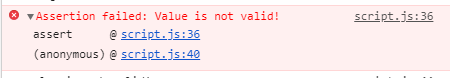
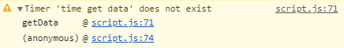

# [Javascript] Unknown Things About Console

<p align="justify">
Xin chào mọi người, tiếp tục với Javascript thì hôm này mình sẽ chia sẻ một chút hiểu biết về <i>Console</i>.

Nhắc tới <i>Console</i> hẳn ai cũng rất quen thuộc và đặc biệt là function <i>console.log</i> của Console - in giá trị ra màn hình rất hay được sử dụng để debug ngay cả khi chúng ta đã có <i>Developer Tools</i> của browser.

Vậy liệu rằng <i>Console</i> chỉ có function console.log hay nó còn có những function hay ho khác mà ta chưa biết. 
</p>

## 1. Console Logging
<p align="justify">
Ngoài <i>console.log</i> được dùng để in giá trị ra màn hình thì <i>Console</i> còn có <i>info</i>, <i>warn</i> và <i>error</i>.

Những function này được sử dụng để in thông in ra màn hình theo severity.
</p>

```javascript
console.log("Hello World!");
console.info("Hello Info");
console.warn("Hello Warn");
console.error("Hello Error");
```
Kết quả:
<p align="center"></p>
<p align="justify">
Nhờ vậy chúng ta có thể lọc message theo category như cột bên trái của <i>Tab Console</i> trong <i>Developer Tools</i> của browser.

Ngoài việc in giá trị, message ra màn hình thì các function <i>warn</i> và <i>error</i> cũng show stack trace giúp chúng ta có thể biết được lỗi đang nằm ở đâu.

Để in ra stack trace thì chúng ta cũng có thể sử dụng function <i>trace</i>:
</p>

```javascript
1   function trace() {
2       var name = "Tuan Anh Trace";
3       console.log(name);
4       console.trace(name);
5   };
6
7   trace();
```
Kết quả:
<p align="center"></p>

## 2. Console Assert
<p align="justify">
Giả sử chúng ta đang muốn thực hiện validate một giá trị, nếu giá trị không hợp lệ thì chúng ta sẽ in một message thông báo ra console.

Để đơn giản mình sẽ lấy <i>value = true, false</i>:
</p>

```javascript
1   function validate(value) {
2       if (!value) {
3           console.log('value is not valid!');
4       }
5   }
6
7   validate(true);
8   validate(false);
```
Kết quả:
<p align="center"></p>
<p align="justify">
Tuy nhiên, chúng ta có một function tốt hơn rất nhiều để có thể in ra message, đồng thời nó cũng show ra stack trace. Đó chính là function <i>assert</i>:
</p>

```javascript
1   function assert(isTrue) {
2       console.assert(isTrue, 'Value is not valid!');
3   }
4
5   assert(true);
6   assert(false);
```
Kết quả:
<p align="center"></p>

## 3. Console Count
<p align="justify">
Function <i>count</i> được sử dụng để đếm số lần là function này được gọi, function này có một optional parameter.
</p>

```javascript
1   function count() {
2       var number = [1, 2, 3, 4, 5, 6, 7, 8, 9, 10];
3       number.forEach(value => {
4           if (value % 2) {
5               console.count('Even number: ');
6           }else {
7               console.count('Odd number');
8           }
9       });
10  }
11
12  count();
```

## 4. Console Time
<p align="justify">
Chúng ta có thể sử dụng <i>console.time</i> và <i>console.timeEnd</i> để tính tổng thời gian thực hiện tất cả những thứ nằm giữa 2 function này. Chúng ta có thể truyền vào một parameter là tên của timer.
</p>

```javascript
1   function getData() {
2       var total = 1000;
3       console.time('time get data');
4       for(i = 0; i < total; i ++) {
5           console.log('data');
6       }
7       console.timeEnd('time get data');
8   }
9
10  getData();
```
Kết quả:
<p align="center"></p>
<p>Chú ý nếu tên của timer ở 2 function không giống nhau thì ta sẽ nhận được một warning message:</p>
<p align="center"></p>

##  5. Console Group
<p align="justify">
Chúng ta sử dụng <i>console.group</i> và <i>console.groupEnd</i> để nhóm các giá trị được log trong console thành những group khác nhau. Chúng ta có thể đặt tên cho các group:
</p>

```javascript
1   function group() {
2       console.group('Pet');
3       console.group('Dog');
4       console.log('Pull');
5       console.log('Alaska');
6       console.group('Rottweiler');
7       console.log('Rottweiler German');
8       console.log('Rottweiler Mixed');
9       console.groupEnd();
10      console.groupEnd();
11      console.group('Cat');
12      console.groupEnd();
13  }
14
15  group();
```
Kết quả:
<p align="center"></p>

## 6. Console Table
Function <i>console.table</i> giúp ta có thể hiển thị array hoặc object dưới dạng table:

```javascript
1   function logTable(object) {
2       console.table(object);
3   }
4
5   function logArrayAsTable() {
6       var arr = [1, 2, 3, 4, 5];
7       logTable(arr);
8   }
9
10  function logObjectAsTable() {
11      var obj = {
12          name: 'Tuan Anh',
13          gender: 'Male'
14      }
15      logTable(obj);
16  }
17
18  logArrayAsTable();
19  logObjectAsTable();
```
Kết quả:
<p align="center"></p>

## 7. Console Style Sheet
Khi in value ra console, chúng ta cũng có thể sử dụng style sheet cho các value bằng cách sử dụng format <i>%c</i> . Tất cả những value đứng đằng sau %c sẽ được áp dụng style sheet đó.

```javascript
1   function styleSheet() {
2       console.log(
3           'Hello %cTuan Anh%c !!!!!!',
4           'color: red; font-weight: bold; font-size: 30px;);',
5           'color: green; font-weight: bold; font-size: 15px;'
6       );
7   }
8
9   styleSheet();
```
Kết quả:
<p align="center"></p>
<br/>
<br/>
Trên đây là một số function của <i>Console</i> trong Javascript, khá thú vị phải không nào.

Hẹn gặp lại các bạn trong những bài chia sẻ tiếp theo.