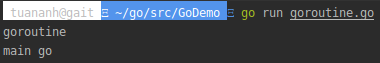
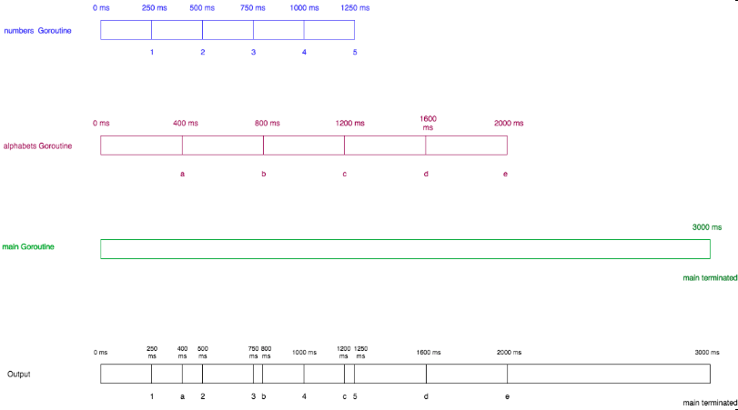

# [Golang] Goroutines

<p align="justify">
Xin chào các bạn, thời gian gần đây mình được tiếp cận và học hỏi với ngôn ngữ Golang, thấy khá là thú vị nên hôm nay mình sẽ chia sẻ một bài viết liên quan tới Golang.

Golang là một ngôn ngữ lập trình được thiết kế dựa trên tư duy lập trình hệ thống. Golang được phát triển bởi Robert Griesemer, Rob Pike và Ken Thompson tại Google vào năm 2007. Golang là một ngôn ngữ biên dịch như C/C++, Java, Pascal… Golang được giới thiệu vào năm 2009 và được sử dụng hầu hết trong các sản phẩm của Google.

Một trong những điểm mạnh của Golang đó là hỗ trợ concurrency (đồng thời), để thực hiện được việc đó trong Golang có Goroutines và Channel.

Ngày hôm nay, chúng ta sẽ tìm hiểu về Goroutines trong Golang.
</p>

## 1. What are Goroutines?
<p align="justify">
Goroutines là các function hoặc method chạy đồng thời với các function hoặc method khác. Goroutines có thể được coi như light weight threads. Việc tạo ra Goroutine tốn rất ít chi phí tài nguyên so với thread. Do đó, những ứng dụng Go có hàng nghìn Goroutines chạy đồng thời.

Những ưu điểm của Goroutines so với Thread:
</p>

*   <p align="justify">Chi phí để tạo Goroutines thấp hơn nhiều so với Thread. Chúng chỉ chiếm khoảng vài kb trong stack và stack có thể "phình to" và "thu nhỏ" tùy vào nhu cầu của chương trình, trong khi đó các Thread trong stack phải được xác định cụ thể và không thể thay đổi.</p>

*   <p align="justify">Goroutines được gán với số lượng OS thread ít hơn. Trong một chương trình có thể có hàng ngàn Goroutines được gán cho một OS thread. Nếu bất kỳ Goroutine nào trong thread đó đang bị block thì một OS thread mới sẽ được sinh ra và tất cả các Goroutines còn lại sẽ được gán vào OS thread mới này. </p>

*   <p align="justify">Goroutines trao đổi với nhau thông qua Channel. Channel được thiết kế để ngăn ngừa race condition xảy ra khi truy cập share memory bởi Goroutines. </p>

## 2. How to start a Goroutine?
<p align="justify">Để start một Gorountine, chúng ta thêm từ khóa <i>go</i> trước function hoặc method.</p>

```golang
1   package main
2
3   import (
4       "fmt"
5   )
6
7   func helloGo() {
8       fmt.Println("goroutine")
9   }
10  func main() {
11      go helloGo()
12      fmt.Println("main go")
13  }
```
<sub>*[Run program in playground](https://play.golang.org/p/zC78_fc1Hn)*</sub>

<p align="justify"><i>go helloGo()</i> start một Goroutine mới. Và bây giờ <i>helloGo()</i> function sẽ chạy đồng thời với <i>main()</i> function. <i>Main</i> function sẽ được run trên Goroutine của riêng nó và nó được gọi là <i>main goroutine</i>.

Kết quả:
</p>
<p align="center"></p>
<p align="justify">
Chương trình chỉ in ra <i>main go</i>. Điều gì đã xảy ra khi goroutine được start? Chúng ta cần hiểu được hai tính chất chính sau của goroutine để biết được chính xác điều gì đã xảy ra:
</p>

* <p align="justify">Khi một Goroutine mới được start, việc call goroutine sẽ return ngay lập tức. Không giống như function, hệ thống không chờ Goroutine được thực thi xong, mà return ngay lập tức dòng code tiếp theo ngay sau dòng code gọi Goroutine và mọi giá trị trả về từ Goroutine sẽ bị bỏ qua.</p>

* <p align="justify">Main Goroutine cần được thực thi để các Goroutine khác có thể chạy được. Nếu Main Goroutine chấm dứt thì chương trình cũng chấm dứt và không Goroutine nào được thực thi nữa.</p>

<p align="justify">
Quay trở lại ví dụ trên, sau khi gọi <i>go helloGo()</i> (line 11), hệ thống trả về ngay lập tức dòng tiếp theo của code mà không đợi <i>helloGo</i> goroutine kết thúc và in ra <i>main go</i>. Sau đó <i>main</i> Goroutine dừng khi không còn đoạn code nào để thực thi và do đó, <i>helloGo</i> goroutine cũng bị chấm dứt.

Vậy làm thể nào để in ra kết quả mong muốn? Chúng ta sẽ fix lại đoạn code trên như sau:
</p>

```golang
1   package main
2
3   import (
4       "fmt"
5       "time"
6   )
7
8   func helloGo() {
9       fmt.Println("goroutine")
10  }
11  func main() {
12      go helloGo()
13      time.Sleep(1 * time.Second)
14      fmt.Println("main go")
15  }
```
<sub>*[Run program in playground](https://play.golang.org/p/U9ZZuSql8-)*</sub>

Kết quả:
<p align="center"></p>
<p align="justify">
Sử dụng <i>Sleep</i> function của <i>time</i> package để slepp <i>main</i> goroutine đi 1s, dó đó <i>helloGo</i> goroutine có đủ thời gian để thực thi trước khi <i>main</i> goroutine kết thúc và ta có kết quả mong muốn.

Cách sử dụng sleep trong main function để chờ các goroutine khác hoàn thành việc thực thi chỉ là để chúng ta hiểu được Goroutine làm việc như thế nào. Trong thực tế, <i>Channel</i> có thể block <i>main</i> Goroutine cho đến khi tất cả các goroutine khác hoàn thành việc thực thi. Về <i>Channel</i> thì mình sẽ nói trong một bài viết khác.
</p>

## 3. Starting multiple Goroutines
<p align="justify">Chúng ta sẽ viết một chương trình khác với nhiều goroutine để hiểu hơn nhé.</p>

```golang
1   package main
2
3   import (
4       "fmt"
5       "time"
6   )
7
8   func numbers() {
9       for i := 1; i <= 5; i++ {
10          time.Sleep(250 * time.Millisecond)
11          fmt.Printf("%d ", i)
12      }
13  }
14  func alphabets() {
15      for i := 'a'; i <= 'e'; i++ {
16          time.Sleep(400 * time.Millisecond)
17          fmt.Printf("%c ", i)
18      }
19  }
20  func main() {
21      go numbers()
22      go alphabets()
23      time.Sleep(3000 * time.Millisecond)
24      fmt.Println("main terminated")
25  }
```
<sub>*[Run program in playground](https://play.golang.org/p/oltn5nw0w3)*</sub>
<p align="justify">
Chúng ta start <i>numbers</i> goroutine và <i>alphabets</i> (line 21 và 22) goroutine. Hai Goroutine này chạy đồng thời với nhau.

<i>number</i> Goroutine được khởi tạo thời gian sleep là 250 ms và sau đó in ra <i>1</i>, sau đó tiếp tục sleep và in ra <i>2</i>, cứ thế tiếp tục đến khi in ra <i>5</i>. 

Tương tự, <i>alphabets</i> Goroutine in ra các chữ cái từ <i>a</i> đến <i>e</i> và sleep 400ms. 

<i>Main</i> Goroutine start <i>numbers</i> và <i>alphabets</i> Goroutine, được sleep trong 3000 ms và sau đó dừng lại.
</p>
Kết quả:
<p align="center"></p>

<p align="justify">
Ảnh bên dưới mô tả chương trình trên làm việc như thế nào:
</p>
<p align="center"></p>
<p align="justify">
Tại phần đầu tiên có màu xanh lam đại diện cho <i>numbers Goroutine</i> , phần thứ hai có màu đỏ đại diện cho <i>alphabets Goroutine</i> , phần thứ ba màu xanh lá cây đại diện cho <i>main Goroutine</i> và phần cuối cùng màu đen hợp nhất tất cả ba phần trên chương trình hoạt động.

Các chuỗi như <i>0 ms</i>, <i>250 ms</i> ở đầu mỗi phần biểu thị thời gian tính bằng mili giây và output được biểu thị ở dưới cùng của mỗi phần là <i>1, 2, 3 , v.v</i>. 

Phần màu xanh lam cho chúng ta biết rằng <i>1</i> được in sau <i>250 ms</i>, <i>2 được in sau </i>500 ms và cứ thế các số khác tiếp tục được in. 

Phần màu đen ở phía dướicó các giá trị <i>1 a 2 3 b 4 c 5 d e main terminated</i> đó chính là output của chương trình.
</p>
<br/>
<p align="justify">Bài viết về Goroutine của mình đến đây là kết thúc, hẹn gặp lại các bạn trong bài viết tiếp theo về <i>Channel</i> nhé.</p>
