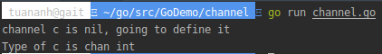
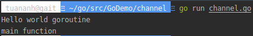
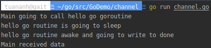
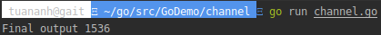

## [Golang] Channels - Part 1 

<p align="justify">Chào các bạn, ở bài viết lần trước chúng ta đã thảo luận về Goroutine. Vậy các Goroutine giao tiếp với nhau bằng cách nào. Đó chính là sử dụng Channels, bài viết hôm nay chúng ta sẽ thảo luận về nó.</p>

## 1. What are channels ?
<p align="justify">Channels là các kênh mà goroutine sử dụng để giao tiếp với nhau. Data có thể được gửi và nhận giữa các goroutine thông qua channel.</p>

## 2. Declaring channels
<p align="justify">Mỗi channel có một kiểu dữ liệu liên kết với nó. Và channel sẽ chỉ cho phép gửi nhận data mang kiểu dữ liệu đó.</p>

```golang
chan T //is a channel of type T
```
<p align="justify">Zero value của channel là <i>nil</i>. <i>nil channels</i> sẽ không sử dụng được mà chúng ta phải define nó tương tự như <i>maps</i> và <i>slices</i> bằng cách sử dụng <i>make</i>.

Khai báo channel:
<p>

```golang
1   package main
2   
3   import "fmt"
4   
5   func main() {  
6       var c chan int
7       if c == nil {
8           fmt.Println("channel c is nil, going to define it")
9           c = make(chan int)
10          fmt.Printf("Type of c is %T", c)
11      }
12  }
```
<sub>*[Run program in playground](https://play.golang.org/p/QDtf6mvymD)*</sub>
<p align="justify">Channel <i>c</i> được khai báo tại dòng 6 là <i>nil</i> vì zero value của channel là <i>nil</i>. Khi đó điều kiện if thỏa mãn và channel được khởi tạo. <i>c</i> trong chương trình trên là một <i>int</i> channel. Chương trình này sẽ cho kết quả: </p>
<p align="center"></p>
<p align="justify">Chúng ta cũng có thể sử dụng cách khai báo ngắn ngon như thông thường để khai báo một channel. </p>

```golang
c := make(chan int)  
```

## 3. Sending and receiving from channel
<p align="justify">Cú pháp để gửi và nhận data từ channel như sau:</p>

```golang
data := <- c // read from channel c  
c <- data // write to channel c 
```
<p align="justify">Hướng mũi tên sẽ xác định data được gửi hay nhận từ channel.
<br/>
Ở dòng 1, hướng mũi tên đi ra từ <i>c</i> do đó chúng ta đang nhận dữ liệu từ channel <i>c</i> và assign vào biến <i>data</i>.
<br/>
Ở dòng 2, hướng mũi tên đi vào <i>c</i> và chúng ta đang gửi <i>data</i> tới channel <i>c</i>.</p>

## 4. Sends and receives are blocking by default
<p align="justify">
Mặc định việc gửi và nhận từ channel sẽ bị block. Điều này có nghĩa là gì? Khi dữ liệu được gửi tới một channel thì việc gửi sẽ bị block cho đến khi có một Goroutine khác đọc dữ liệu từ channel đó. Tương tự như khi đọc dữ liệu từ một channel, việc đọc sẽ bị block cho đến khi có một Goroutine khác ghi dữ liệu tới channel.

Tính chất này của channel giúp các Goroutine có thể giao tiếp với nhau một cách hiệu quả và dễ dàng mà không cần phải sử dụng từ khóa lock hoặc condition variable, những thứ khá phổ biến trong ngôn ngữ khác.
</p>

## 5. Channel example program
Hãy cùng xem một số ví dụ để hiểu về channel

```golang
1   package main
2   
3   import (  
4       "fmt"
5       "time"
6   )
7   
8   func hello() {  
9       fmt.Println("Hello world goroutine")
10  }
11  func main() {  
12      go hello()
13      time.Sleep(1 * time.Second)
14      fmt.Println("main function")
15  }
```
<sub>*[Run program in playground](https://play.golang.org/p/U9ZZuSql8-)*</sub>
<p align="justify">Ở đây chúng ta sử dụng sleep để  <i>main</i> goroutine đợi <i>hello</i> goroutine có thể hoàn thành việc execute.
<br/>
Chúng ta sẽ viết lại chương trình trên bằng cách sử dụng channel:</p>

```golang
1   package main
2   
3   import (  
4       "fmt"
5   )
6 
7   func hello(done chan bool) {  
8       fmt.Println("Hello world goroutine")
9       done <- true
10  }
11  func main() {  
12      done := make(chan bool)
13      go hello(done)
14      <-done
15      fmt.Println("main function")
16  }
```
<sub>*[Run program in playground](https://play.golang.org/p/I8goKv6ZMF)*</sub>
<p align="justify">
Ở chương trình trên chúng ta tạo một <i>bool channel</i> có tên <i>done</i> (line 12) và truyền nó vào <i>hello</i> Goroutine. Chúng ta nhận dữ liệu từ <i>done</i> channel (line 14), và dòng code này đang block cho đến khi có một Goroutine khác ghi dữ liệu tới <i>done</i> channel, dòng code tiếp theo sẽ chưa được thực thi. Ở đây chúng ta đã loại bỏ được việc dùng time.Sleep để ngăn <i>main</i> Goroutine exit.

Dòng code <i><- done</i>(lien 14) nhận dữ liệu từ <i>done</i> channel nhưng không sử dụng hay lưu trữ dữ liệu vào bất kỳ biến nào cả. Điều này hoàn toàn được cho phép và hợp lệ.

Bây giờ chúng ta thấy rằng <i>main</i> Goroutine đã bị block và chờ dữ liệu từ <i>done</i> channel. <i>hello</i> Goroutine nhận param là <i>done</i> channel, print <i>Hello world goroutine</i> ra console và sau đó ghi dữ liệu vào <i>done</i> channle. Khi việc ghi dữ liệu được hoàn thành, <i>main</i> Goroutine sẽ nhận dữ liệu  từ <i>done</i> channle, nó sẽ được unblock và sau đó đoạn text <i>main function</i> được print.

Kết quả:
</p>
<p align="center"></p>
<p align="justify">Hãy thay đổi chương trình này bằng việc thêm sleep trong <i>hello</i> Goroutine để hiểu hơn về khái niệm <i>blocking</i>.</p>

```golang
1   package main
2   
3   import (  
4       "fmt"
5       "time"
6   )
7
8   func hello(done chan bool) {  
9       fmt.Println("hello go routine is going to sleep")
10      time.Sleep(4 * time.Second)
11      fmt.Println("hello go routine awake and going to write to done")
12      done <- true
13  }
14  func main() {  
15      done := make(chan bool)
16      fmt.Println("Main going to call hello go goroutine")
17      go hello(done)
18      <-done
19      fmt.Println("Main received data")
20  }
```
<sub>*[Run program in playground](https://play.golang.org/p/EejiO-yjUQ)*</sub>
<p align="justify">
Trong chương trình trên chúng ta sleep 4s trong <i>hello</i> function tại dòng 10.

Chương trình sẽ print <i>Main going to call hello go goroutine</i> đầu tiên. 
<br/>
Sau đó <i>hello</i> Goroutine sẽ được start và nó sẽ print <i>hello go routine is going to sleep</i>. Sau khi text này được print, <i>hello</i> Goroutine sẽ sleep trong 4s và trong khoảng thời gian này <i>main</i> Goroutine sẽ bị block vì nó đang chờ dữ liệu từ <i>done</i> channel (line 18). 
<br/>
Sau 4s <i>hello go routine awake and going to write to done</i> sẽ được print và cuối cùng là <i>Main received data</i>.

Kết quả:
</p>
<p align="center"></p>

## 6. Another example for channels
<p align="justify">
Chúng ta cùng viết thêm một chương trình nữa để hiểu hơn về channel. Chương trình này sẽ print tổng của các bình phương và lập phương của các chữ số của một số bất kỳ.

Ví dụ:
</p>

```
Input: n = 123

Program calculate
    squares = (1 * 1) + (2 * 2) + (3 * 3)

    cubes = (1 * 1 * 1) + (2 * 2 * 2) + (3  * 3 * 3)

Output: squares + cubes = 50
```
<p align="justify">
Chúng ta sẽ để việc tính toán <i>squares</i> và <i>cubes</i> tại hai Goroutine riêng biêt và kết quả tổng cuối cùng sẽ được tính trong <i>main</i> Goroutine
</p>

```golang
1   package main
2   
3   import (  
4       "fmt"
5   )
6   
7   func calcSquares(number int, squareop chan int) {  
8       sum := 0
9       for number != 0 {
10          digit := number % 10
11          sum += digit * digit
12          number /= 10
13      }
14      squareop <- sum
15  }
16  
17  func calcCubes(number int, cubeop chan int) {  
18      sum := 0 
19      for number != 0 {
20          digit := number % 10
21          sum += digit * digit * digit
22          number /= 10
23      }
24      cubeop <- sum
25  } 
26  
27  func main() {  
28      number := 589
29      sqrch := make(chan int)
30      cubech := make(chan int)
31      go calcSquares(number, sqrch)
32      go calcCubes(number, cubech)
33      squares, cubes := <-sqrch, <-cubech
34      fmt.Println("Final output", squares + cubes)
35  }
```
<sub>*[Run program in playground](https://play.golang.org/p/4RKr7_YO_B)*</sub>
<p align="justify">
<i>calcSquares</i> function (line 7) sẽ tính toán tổng bình phương của các chữ số của <i>number</i> và gửi kết quả tới <i>squareop</i> channel. Tương tự với <i>calcCubes</i> function (lỉe 17) cũng tính toán tổng lập phương của các chữ số của <i>number</i> và gửi kết quả tới <i>cubeop</i> channel.

Hai function này sẽ được chạy trong hai Goroutine riêng biệt (line 31 và 32) và mỗi function được truyển param là channel để ghi kết quả vào đó.

<i>main</i> Goroutine sẽ chờ dữ liệu từ cả hai channel này (line 33). Khi dữ liệu được nhận từ các channel này, nó sẽ được lưu vào các biến <i>squares</i> và <i>cubes</i> và kết quả cuối cùng được tính toán và print.

Kết quả:
</p>
<p align="center"></p>
<br/>
<br/>
<p align="justify">
Vậy là phần 1 thảo luận về channel đã kết thúc, tại phần 2 mình sẽ chia sẻ với các bạn về  <i>deadlock</i>, <i>unidirectional channels</i>, <i>close channel</i> và sử dụng <i>range</i> để loop một channel.

Hẹn gặp lại các bạn ở bài viết lần sau.
</p>