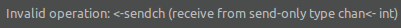

# [Golang] Channels - Part 2

<p align="justify">
Trong bài viết <i><a href="https://github.com/tuananhnguyen-ima/Sun-Monthly-Reports/blob/master/reports/201902.md">Channels - Part 1</a></i> trước chúng ta đã hiểu được channel là gì, cơ chế gửi nhận của channel và thực hành một số ví dụ.

Trong bài viết lần này, tôi sẽ tiếp tục chia sẻ về Channel.
</p>

## 1. Deadlock
<p align="justify">
Một vấn đề quan trọng khi sử dụng Channel là deadlock. nếu một Goroutine đang gửi data trên một channel, thì nó kì vọng rằng sẽ có một Goroutine khác đang thực hiện việc nhận data. Nếu điều này không xảy ra thì chương trình của chúng ta sẽ panic tại runtime cùng với <b><i>Deadlock</b></i>

Tương tự, nếu một Goroutine đang chờ nhận data từ channel, thì một Goroutine khác phải gửi data tới channel đó, nếu không chương trình sẽ bị panic.
</p>

```golang
1   package main
2   
3   func main() {  
4       ch := make(chan int)
5       ch <- 5
6   }
```
<sub>*[Run program in playground](https://play.golang.org/p/q1O5sNx4aW)*</sub>

<p align="justify">
Trong chương trình trên, tôi đã tạo ra channel <i>ch</i> và gửi 5 tới channel này (line 5). Trong chương trình này không có Goroutine nào đang nhận data từ channel <i>ch</i>. Do đó chương trình sẽ bị panic với runtime error bên dưới.
</p>
<br/>
<p align="center"></p>

## 2. Unidirectional channels
<p align="justify">
Tất cả những channel chúng ta đã thảo luận và các ví dụ đều là về <i>bidirectional channels</i> (channel 2 chiều), điều này có nghĩa rằng data có thể được gửi và nhận thông qua chúng. Chúng ta cũng có thể tạo ra một <i>unidirectional channels</i> (channel 1 chiều), một channel chỉ đảm nhận việc nhận hoặc gửi data.
</p>

```golang
1   package main
2   
3   import "fmt"
4   
5   func sendData(sendch chan<- int) {  
6       sendch <- 10
7   }
8   
9   func main() {  
10      sendch := make(chan<- int)
11      go sendData(sendch)
12      fmt.Println(<-sendch)
13  }
```
<sub>*[Run program in playground](https://play.golang.org/p/PRKHxM-iRK)*</sub>

<p align="justify">
Trong chương trình trên, tôi đã tạo ra channel chỉ gửi data <i>sendch</i> (line 10). Tại line 12, tôi đang nhận data từ một channel chỉ gửi data. Điều này không được phép và khi chương trình run, trình biên dịch sẽ thông báo:
</p>
<p align="center"></p>

<p align="justify">
Chúng ta có thể convert một channel 2 chiều thành channel chỉ gửi hoặc nhận data nhưng không thể convert ngược lại.
</p>

```golang
1   package main
2   
3   import "fmt"
4   
5   func sendData(sendch chan<- int) {  
6       sendch <- 10
7   }
8   
9   func main() {  
10      chnl := make(chan int)
11      go sendData(chnl)
12      fmt.Println(<-chnl)
13  }
```
<sub>*[Run program in playground](https://play.golang.org/p/aqi_rJ1U8j)*</sub>

<p align="justify">
Tại line 10, tôi đã tạo ra một channel 2 chiều <i>chnl</i>. Nó được truyền như một parameter của <i>sendData</i> Goroutine tại line 11. Phương thức <i>sendData</i> sẽ convert channel này thành channel chỉ gửi data (line 5). Channel bây giờ chỉ có thể send data bên trong <i>sendData</i> Goroutine nhưng nó channel 2 chiều trong main Goroutine.
</p>

## 3. Closing channels and for range loops on channels
<p align="justify">
Sender có khả năng close một channel để thông báo cho receiver rằng không còn data nào được gửi tới channel nữa.

Receiver có thể sử dụng một variable bổ sung trong khi đang nhận data từ channel để kiểm tra xem channel đã bị close hay chưa
</p>

```golang
v, ok := <- ch 
```
<p align="justify">
Trong statement trên <i>ok</i> là true nếu giá trị được nhận bới việc gửi thành công data tới channel. Nếu <i>ok</i> là false có nghĩa rằng chúng ta đang nhận data từ một close channel. Giá trị đọc từ một channel đã close sẽ là zero value của kiểu channel. VD nếu channel là một <i>int</i> channel thì value được nhận từ channel đã close sẽ là <i>0</i>.
</p>

```golang
1   package main
2   
3   import (  
4       "fmt"
5   )
6   
7   func producer(chnl chan int) {  
8       for i := 0; i < 10; i++ {
9           chnl <- i
10      }
11      close(chnl)
12  }
13  func main() {  
14      ch := make(chan int)
15      go producer(ch)
16      for {
17          v, ok := <-ch
18          if ok == false {
19              break
20          }
21          fmt.Println("Received ", v, ok)
22      }
23  }
```
<sub>*[Run program in playground](https://play.golang.org/p/XWmUKDA2Ri)*</sub>

<p align="justify">
Trong chương trình trên, producer Goroutine sẽ ghi từ 0 tới 9 tới <i>chnl</i> channel và sau đó close channel. Main function có một vòng lặp for vô hạn (line 16) sẽ kiểm tra channel đã close hay chưa thông qua <i>ok</i> variable (line 18). Nếu <i>ok</i> là false có nghĩa rằng channel đã bị close và sẽ thoát khỏi vòng lặp. Nếu như channel chưa bị close thì giá trị trong channel và giá trị của ok sẽ được print.
</p>
<p align="center"></p>
<p align="justify">
Chúng ta có thể sử dụng <i>for range</i> cho vòng lặp for để nhận value từ một channel cho đến khi nó bị close. Hãy viết lại chương trình trên với vòng lặp for range
</p>

```golang
1   package main
2   
3   import (  
4       "fmt"
5   )
6   
7   func producer(chnl chan int) {  
8       for i := 0; i < 10; i++ {
9           chnl <- i
10      }
11      close(chnl)
12  }
13  func main() {  
14      ch := make(chan int)
15      go producer(ch)
16      for v := range ch {
17          fmt.Println("Received ",v)
18      }
19  }
```
<sub>*[Run program in playground](https://play.golang.org/p/JJ3Ida1r_6)*</sub>
<p align="justify">
Vòng lặp for range (line 16) nhận data từ ch channel cho đến khi nó bị close. Khi ch bị close, vòng lặp sẽ tự động exit. 
<br/>
<br/>
<br/>
Trong channel còn có một số khái niệm như buffer channel, worker pools và select. Chúng ta sẽ thảo luận những điều này trong một bài viết khác. 

Hẹn gặp lại các bạn trong bài viết tiếp theo.
</p>
