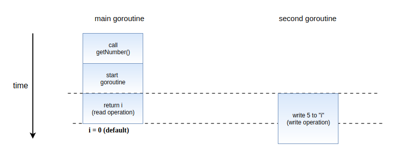
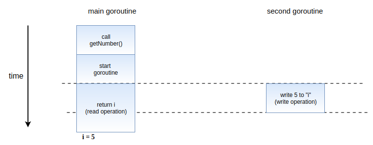
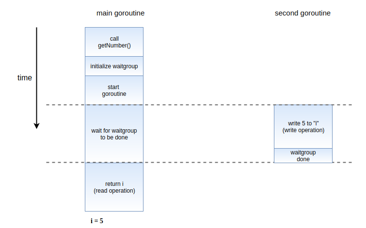
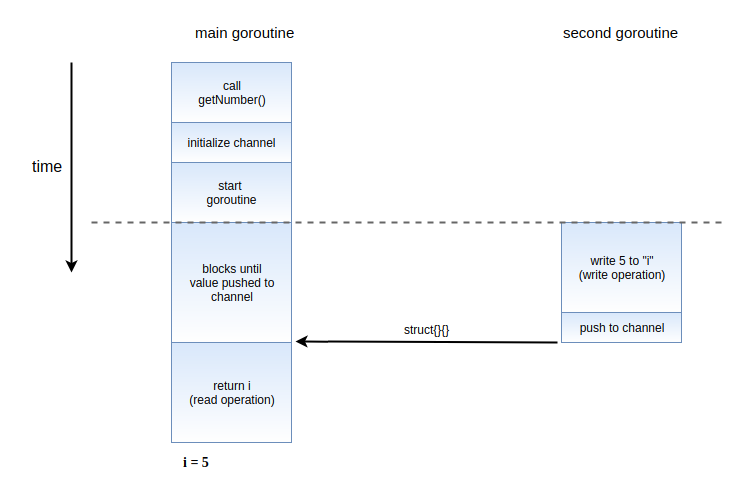
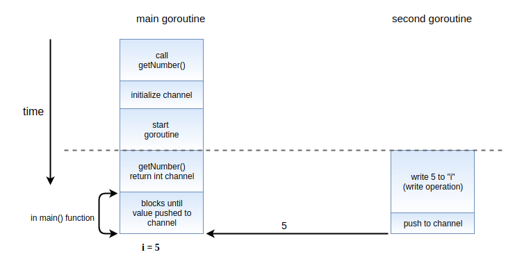
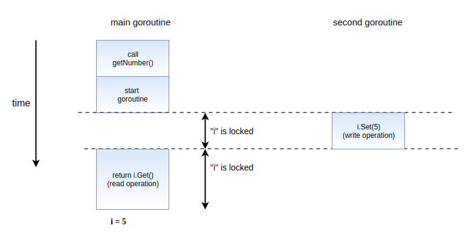
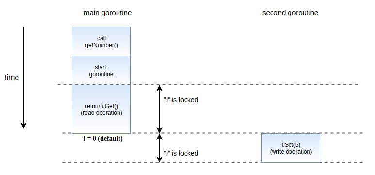

# [Golang] Dataraces In Go And How To Fix Them
<p align="justify">
Go được biết đến với việc dễ dàng xây dựng một concurrent programs. Nhưng với concurrent nó có khả năng gây ra data race, một lỗi rất khó debug nếu như chúng ta không may gặp phải trong code.

Trong bài viết này chúng ta sẽ xây dựng một program gây ra data race và sử dụng <i><a href="https://golang.org/doc/articles/race_detector.html">race detector</a></i> tool để phát hiện chúng. Chúng ta cũng sẽ xem xét một số phương pháp để giải quyết race condition.
</p>

## The data race
Để giải thích data race là gì, chúng ta cùng xem ví dụ sau:
```golang
package main

import "fmt"

func main() {
	fmt.Println(getNumber())
}

func getNumber() int {
	var i int
	go func() {
		i = 5
	}()

	return i
}
```
<sub>*[Run program in playground](https://play.golang.org/p/TvaREY1QDFx)*</sub>

<p align="justify">

Ở đây chúng ta có thể thấy rằng function `getNumber` đang thiết lập giá trị của `i` trong một goroutine riêng biệt. getNumber sẽ return giá trị của i, tuy nhiên chúng ta không biết rằng goroutine trên đã hoàn thành hay chưa.

Sẽ có hai trường hợp xảy ra:
1. Giá trị của `i` sẽ là `5`
2. Giá trị của `i` đang được thiết lập và trả về do goroutine chưa hoàn thành

Tùy thuộc vào trường hợp nào xảy ra trước sẽ quyết định giá trị của `i` được in ra sẽ là `0` hay `5`

Đây là lý do tại sao nó được gọi là *race condition*: giá trị trả về từ `getNumber` thay đổi tùy thuộc vào operation nào kết thúc trước
</p>

<p align="center">
<br/>
<i>Data race với operation đọc giá trị của `i` hoàn thành trước.</i>
</p>

<p align="center">
<br/>
<i>Data race với operation ghi giá trị vào `i` hoàn thành trước.</i>
</p>

## Detecting a data race
<p align="justify">
Ở trên là một ví dụ rất đơn giản để hiểu được data race là gì. Trong các ứng dụng lớn hơn data race sẽ khó phát hiện hơn nhiều. May mắn rằng, Go (kể từ v1.1) có một data race detector giúp chúng ta phát hiện những điểm có nguy cơ gây ra data race condition.

Chỉ đơn giản bằng cách sử dụng `-race` flag. Ví dụ hãy thử run program trên với `-race` flag
```
go run -race main.go
```
Chúng ta có thể  thấy output như dưới đây
```
0
==================
WARNING: DATA RACE
Write at 0x00c00009e010 by goroutine 6:
  main.getNumber.func1()
      /home/tuananh/go/src/GoDemo/test/main.go:12 +0x38

Previous read at 0x00c00009e010 by main goroutine:
  main.getNumber()
      /home/tuananh/go/src/GoDemo/test/main.go:15 +0x88
  main.main()
      /home/tuananh/go/src/GoDemo/test/main.go:6 +0x33

Goroutine 6 (running) created at:
  main.getNumber()
      /home/tuananh/go/src/GoDemo/test/main.go:11 +0x7a
  main.main()
      /home/tuananh/go/src/GoDemo/test/main.go:6 +0x33
==================
Found 1 data race(s)
exit status 66
```
Đầu tiên là `0` sẽ được in. Các line tiếp theo sẽ cho chúng ta biết thông tin về data race được phát hiện.

Chúng ta có thể  thấy rằng thông tin nhận được về data race gồm có 3 phần:
1. Phần đầu tiên cho chúng ta biết có một operation write trong một goroutine (line 12 - gán giá trị `5` cho `i`)
2. Phần tiếp theo cho chúng ta biết có một operation read đồng thời bởi main goroutine, trong code được trace tại line 6 - print statement và line 15 - retrun statement
3. Phần thứ 3 cho biết nơi tạo ra goroutine gây ra race condition (line 11)

Ta có thể thấy rằng, chỉ cần thêm `-race` flag, câu lệnh `go run` đã cho chúng ta biết thông tin về race condition trong program. `-race` flag cũng có thể thêm vào `go build` hoặc `go test`
</p>

## Fixing data races
<p align="justify">
Go cung cấp rất nhiều cách khác nhau để giải quyết data races. Tất cả các giải pháp này giúp đảm bảo rằng quyền truy cập vào variable đang được đề cập sẽ bị block nếu chúng ta đang thực hiện write operation vào chúng.
</p>

### Blocking with waitgroups
<p align="justify">
Một trong những cách đơn giản nhất để giải quyết data race là block quyền truy cập read cho đến khi nào write operation được hoàn thành
</p>

```golang
package main

import (
	"fmt"
	"sync"
)

func main() {
	fmt.Println(getNumber())
}

func getNumber() int {
	var i int
	// Initialize a waitgroup variable
	var wg sync.WaitGroup
	// `Add(1) signifies that there is 1 task that we need to wait for
	wg.Add(1)
	go func() {
		i = 5
		// Calling `wg.Done` indicates that we are done with the task we are waiting fo
		wg.Done()
	}()
	// `wg.Wait` blocks until `wg.Done` is called the same number of times
	// as the amount of tasks we have (in this case, 1 time)
	wg.Wait()
	return i
}
```
<sub>*[Run program in playground](https://play.golang.org/p/RHbGQOI3cUv)*</sub>

<p align="center">
</p>

Về `WaitGroups` trong Go, tôi sẽ có một bài viết chi tiết sau.

### Blocking with channels
<p align="justify">
Phương pháp này có nguyên tắc tương tự như trên.
Về Channel trong Go, bạn có thể tham khảo các bài viết trước của tôi: <i><a href="https://github.com/tuananhnguyen-ima/Sun-Monthly-Reports/blob/master/reports/201902.md">Channels - Part 1</a></i>, <i><a href="https://github.com/tuananhnguyen-ima/Sun-Monthly-Reports/blob/master/reports/201903.md">Channels - Part 2</a></i>
</p>

```golang
package main

import (
	"fmt"
)

func main() {
	fmt.Println(getNumber())
}

func getNumber() int {
	var i int
	// Create a channel to push an empty struct to once we're done
	done := make(chan struct{})
	go func() {
		i = 5
		// Push an empty struct once we're done
		done <- struct{}{}
	}()
	// This statement blocks until something gets pushed into the `done` channel
	<-done
	return i
}
```
<p align="center">
</p>

<p align="justify">

Blocking bên trong `getNumber` function khá đơn giản. Phương pháp tiếp theo có cách tiếp cận linh hoạt hơn đối với việc thực hiện blocking.
</p>

### Returning a channel 
Thay vì sử dụng channel để block funtion, chúng ta có thể  push giá trị vào một channle và return channle đó. Không giống như hai phương pháp trước, phương pháp này không thực hiện blocking. Thay vào đó blocking sẽ phụ thuộc vào gọi hàm trong code

```golang
package main

import (
	"fmt"
)

func main() {
	// The code is blocked until something gets pushed into the returned channel
	// As opposed to the previous method, we block in the main function, instead
	// of the function itself
	i := <-getNumberChan()
	fmt.Println(i)
}

// return an integer channel instead of an integer
func getNumberChan() <-chan int {
	// create the channel
	c := make(chan int)
	go func() {
		// push the result into the channel
		c <- 5
	}()
	// immediately return the channel
	return c
}
```
<sub>*[Run program in playground](https://play.golang.org/p/POYn3UalH3e)*</sub>
<p align="center">
</p>
<p align="justify">

Cách tiếp cận này linh hoạt hơn ở chỗ, nó cho phép các function ở level cao hơn quyết định cơ chế blocking và concurrency của riêng chúng thay vì coi `getNumber` là synchronous.
</p>

### Using a mutex
<p align="justify">

Cho đến hiện tại, chúng ta quyết định rằng giá trị của `i` chỉ nên được đọc sau khi thao tác ghi đã kết thúc. Tuy nhiên, hãy nghĩ về trường hợp mà chúng ta không quan tới thứ tự của việc đọc ghi, chúng ta chỉ yêu cầu hai thao tác này không xảy ra đồng thời. Để đạt được điều này chúng ta có thể sử dụng `mutex`
</p>

```golang
package main

import (
	"fmt"
	"sync"
)

func main() {
	fmt.Println(getNumber())
}
// First, create a struct that contains the value we want to return
// along with a mutex instance
type SafeNumber struct {
	val int
	m   sync.Mutex
}

func (i *SafeNumber) Get() int {
	// The `Lock` method of the mutex blocks if it is already locked
	// if not, then it blocks other calls until the `Unlock` method is called
	i.m.Lock()
	// Defer `Unlock` until this method returns
	defer i.m.Unlock()
	// Return the value
	return i.val
}

func (i *SafeNumber) Set(val int) {
	// Similar to the `Get` method, except we Lock until we are done
	// writing to `i.val`
	i.m.Lock()
	defer i.m.Unlock()
	i.val = val
}

func getNumber() int {
	// Create an instance of `SafeNumber`
	i := &SafeNumber{}
	// Use `Set` and `Get` instead of regular assignments and reads
	// We can now be sure that we can read only if the write has completed, or vice versa
	go func() {
		i.Set(5)
	}()
	return i.Get()
}
```
<sub>*[Run program in playground](https://play.golang.org/p/SgmxIMSOtyH)*</sub>

<p align="center">
<br/>
<i>Mutex với write locking.</i>
</p>

<p align="center">
<br/>
<i>Mutex với read locking.</i>
</p>

### Conclusion
<p align="justify">
Bất kỳ một phương pháp nào ở trên đều ngăn chặn data race. Mỗi một phương pháp đều có ưu nhược điểm và độ phức tạp khác nhau. Tùy vào tình huống sử dụng mà chúng ta có thể lựa chọn phương pháp phù hợp nhất.

Nguyên tắc cơ bản chính là: ngăn chặn việc đọc ghi đồng thời vào cùng một variable hoặc memory location
</p>


<p align="justify">
Hẹn gặp lại các bạn ở những bài viết tiếp theo.

Reference: https://www.sohamkamani.com/blog/2018/02/18/golang-data-race-and-how-to-fix-it/
</p>


