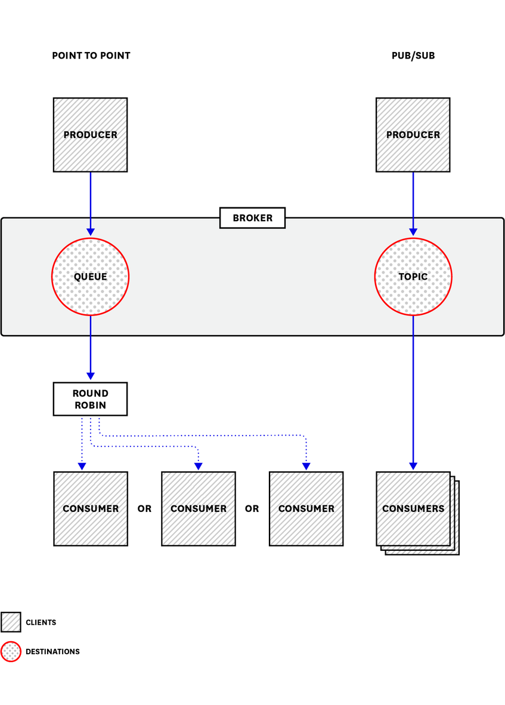

# [Part1] ActiveMQ Architecture And Key Metrics 

Apache ActieMQ là message-oriented middleware (MOM), một loại phần mềm gửi các message giữa các ứng dụng. Sử dụng giao tiếp không đồng bộ dựa trên các tiêu chuẩn, ActiveMQ cho phép loose coupling các phần tử trong một IT enviroment, thường là nền tảng cho các ứng dụng phân tán và hệ thống gửi tin doanh nghiệp.

ActiveMQ là một Java open source project được phát triển bởi <a href="http://activemq.apache.org/">Apache Software Foundation</a>. Nó có thể so sánh với các hệ thống message khác như Apache Kafka, RabbitMQ và Amazon Simple Queue Service. Amazon cũng đưa ra Amazon MQ, một triển khai được quản lý của ActiveMQ, được tích hợp vào các AWS cloud service. Về cơ bản, những công nghệ này hộ trợ các hệ thống gửi tin doanh nghiệp thông qua kiến trúc loose coupling.

ActiveMQ sử dụng Java Message Service (JMS) API, định nghĩa tiêu chuẩn cho phần mềm để sử dụng trong việc tạo, gửi và nhận message. JMS được bao gồm trong Java Enterprise Edition, giúp cho các Java developer có thể sử dụng chúng để tạo các ứng dụng client gửi, nhận và xử lý message. Nó có thể viết các ActiveMQ client bằng các ngôn ngữ khác nhau (VD: Node.js, Ruby, Python), nhưng ActiveMQ được xây dụng trên Java.

Trong bài viết này chúng ta sẽ xem cách ActiveMQ hoạt động như thế nào, và một số thông số ActiveMQ để chúng ta có thể hiểu về hiệu suất của message infrastructure của mình.

## How does ActiveMQ work?

ActiveMQ gửi các message giữa các client application - `producers`, nhiệm vụ là tạo message và gửi chúng, và `consumers` sẽ nhận và xử lý message. ActiveMQ `broker` sẽ điều phối các message thông qua một trong hai loại destination sau:

- một `queue`, nơi mà nó sẽ được phân phối cho một consumer độc lập (được gọi là `point-to-point`)

- một `topic`, sẽ được phân phối tới nhiều consumer đã subscribe topic đó (được gọi là `publish/subscribe` hoặc `pub/sub`)

ActiveMQ cho chúng ta gửi message một cách linh hoạt thông qua cả `queue` và `topic` bằng cách sử dụng một broker. Trong point-to-point messaging, broker sẽ hoạt động như một load balancer, nó sẽ điều phối các message từ queue tới một consumer vaiable theo round-robin pattern (mô hình vòng tròn). Khi bạn sử dụng pub/sub messaging, broker sẽ phân phối mỗi message tới tất cả các consumer đã subcribe topic đó.

`JMS` là chuẩn giao tiếp mà ActiveMQ sử dụng để gửi và nhận message. ActiveMQ là một `JMS provider`, điều này có nghĩa rằng nó triển kahi các fucntion được xác định trong JMS API. Các client application - producers và consumers sử dụng JMS API để gửi mà nhận message. Non-JMS client (được viết bằng PHP, Python hoặc các ngôn ngữ khác) cũng có thể connect tới ActiveMQ broker thông qua `AMQP`, `MQTT` và `STOMP` protocol.

ActiveMQ gửi message không đồng bộ, vì các consumer không cần thiết phải nhận message ngay lập tức. Vì ActiveMQ sử dụng một broker làm trung gian, nên producer và consumer là độc lập, thậm chí chúng cũng không biết về nhau. Ngay khi producer gửi một message tới một broker là nhiệm vụ của chúng đã hoàn thành, bất kể consumer có nhận được message hay không. Ngược lại, khi một consumer nhận một message từ broker, nó đã thực hiện xong nhiệm vụ mà không biết producer nào đã tạo ra message.

Kiểu sắp xếp này, các client không biết về nhau và nó là loose coupling. Những lợi ích của loose coupling bao gồm:

- High throughput (thông lượng cao): Vì các producer không cần chờ tín hiệu từ consumer hay broker, chúng gửi message rất nhanh. ActiveMQ có thể có thông lương hàng nghìn message mỗi giây

- Flexibility (linh hoạt): Các client có thể  tạm thời không khả dụng, có thể được thêm động và các môi trường, có thể được viết bằng ngôn ngữ khác nhau mà không ảnh hưởng tới các client khác hay xảy ra lỗi trong quá trình xử lý message

- Heterogeneity (không đồng nhất): Các client là độc lập với nhau, chúng giao tiếp với ActiveMQ broker chứ không giao tiếp trực tiếp với nhau. Do đó chúng có thể được viết bằng bất kỳ <a href="http://activemq.apache.org/cross-language-clients.html">ngôn ngữ mà ActiveMQ hỗ trợ.</a>

Bởi vì các thành phần của ActiveMQ bị tách rời, nên chúng ta cần kiểm soát các producer, consumer, destination và broker một cách toàn diện để hiểu được context của bất kỳ issues nào có thể phát sinh. Ví dụ, các thông số cho thấy đầu ra của một producer đã bị tạm dừng có thể không cho thấy vấn đề, nhưng nếu chúng được view cùng với các số liệu cho thấy mức độ sử dụng bộ nhớ tăng, đó có thể là nguyên nhân của vấn đề trong các hệ thống lớn. Sau đó chúng ta sẽ xem một số thông số để có bức tranh toàn cảnh về ActiveMQ. Nhưng đầu tiên, chúng ta sẽ xem unit of work của ActiveMQ - message.

### Messages

Mỗi `message` ActiveMQ gửi dưạ trên đặc tả JMS, và nó gồm có các thành phần: `header`, optional `property` và một `body`.

#### Headers

JMS message header có chứa metadata về message. Các header được định nghĩa dựa trên đặc tả JMS, và các giá trị của chúng được set khi producer tạo message hoặc khi ActiveMQ gửi nó đi.

Các header của message sẽ ảnh hưởng tới cách hoạt động của broker và client. Chúng ta sẽ xem hai tính chất tính đến khi ActiveMQ gửi message: expiration và persistence.

##### Message expiration

Tùy thuộc vào nội dung và mục đích, một message có thể không có giá trị sau một khoảng thời gian. Khi producer tạo một messge, nó có thể set một expiration value cho message header. Nếu không thì giá trị của nó là empty và message sẽ không bao giờ expires.

ActiveMQ sẽ loại bỏ bất kì message nào đã expire từ queue hoặc topic thay vì gửi nó, và consumer code dự kiến sẽ không xử lý những message đã expire.

##### Message persistence

Persistence là một tính chất của message. Nó được định nghĩa trong JMS và không phải là unique cho ActiveMQ. ActiveMQ message mặc định là persistence, nhưng chúng ta có thể cấu hình persistence trên cơ sở mỗi message hay cơ sở mỗi producer. Khi gửi một persistent mesasge, broker sẽ lưu trữ message đó vào không gian lưu trữ message trên ổ đĩa trước khi thử gửi. Nếu broker gặp sự cố tại thời điểm đó, một bản copy của message vẫn còn tồn tại, mà quá trình gửi message sẽ được phục hồi khi broker được restart. Một non-persistent message, nói cách khác, chỉ tồn tại duy nhất trong memory của broker và sẽ mất nếu broker restart.

Việc gửi non-persistent message thông thường sẽ nhanh hơn, bởi vì nó không yêu cầu broker thực hiện những hoạt động ghi tốn chi phí. Non-persistent message phù hợp với những data có thời gian ngắn được thay thế  thường xuyên trong khoảng thời gian, ví dụ mỗi một phút sẽ update location của một item.

#### Properties

Properties tương tự như headers, và cung cấp cách thêm những optional metadata tới message. ActiveMQ hỗ trợ một số property được định nghĩa dựa trên đặc tả của JMS và cũng implement một số property không có trong đặc tả.

Producer cũng có thể định nghĩa các property - tùy chọn và nằm ngoài những đặc tả JMS và áp dụng chúng cho những message khác nhau. Các consumer có thể thực hiện selector để filter các message dựa trên những value có trong message property. Ví dụ, chúng ta có thể cấu hình một ActiveMQ producer attach `coin` property vào mỗi message, với giá trị là `heads` hoặc `tails`, và gửi các message này tới cũng một topic. Bạn có thể viết hai consumer - một là `head` consumer và một là `tails` consumer - cả hai đều subcribe topic đó nhưng chỉ nhận message với giá trị xác định của `coin` property.

#### Body

Nội dung của một ActiveMQ message là `body`. Body của một message có thể là text hoặc binary data. (nó cũng có thể chấp nhận với một body là empty). Giá trị của `JMSType` header, cái sẽ được set bởi producer khi message được create, xác định những gì có thể được trong body của message: file, byte stream, Java object, stream của Java primitive, một set của các cặp name-value, hoặc một text string.

Để có nhiều hơn thông tin về message type, hãy xem <a href="https://docs.oracle.com/cd/E19798-01/821-1841/6nmq2cpps/index.html#bncex">JMS documentation</a>

### Memory and storage

ActiveMQ sử dụng memory để lưu trữ các message đang chờ gửi tới các consumer. Mỗi message chiểm một phần bộ nhớ khả dụng (tuy thuộc vào kích thước của message) cho đến khi nó ra khỏi queue - phân phối tới consumer và sau đó được xử lý và xác nhận bởi nguwofi nhận. Tại thời điểm đó, ActiveMQ sẽ giải phóng bộ nhớ đang được sử dụng để lưu trữ message đó. Khi các producer nhanh hơn các consumer - nghĩa rằng sẽ việc enqueue message nhiều hơn là dequeue message trong một khảng thời gian nhất định thì memory được sử dụng bởi ActiveMQ sẽ tăng lên.

ActiveMQ cũng ghi message vào disk, trong kho lưu trữ message (persitent message) hoặc lưu trữ tạm thơi (non-persistent message khi broker hết memory để lưu trữ chúng)

Trong bài viết này hcungs là sẽ xem cách sử dụng memory và disk của ActiveMQ để lưu trữ các message.

#### Memory

